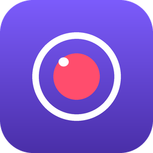

<p align="center">
  
</p>

<h1 align="center">สุ่มเสี่ยงบันทึก</h1>

<p align="center">โปรแกรมบันทึกหน้าจอ PC คมชัดระดับ 4K • เสียง + ไมค์ • ไม่จำกัดเวลา</p>

---

## ✨ ความสามารถ
- **คมชัดถึง 4K** — เลือกได้ตั้งแต่ต้นฉบับ (Native), 4K, 2K, 1080p, 720p
- **ปรับขนาดกรอบครอบจอได้** — เต็มจอ หรือลากเมาส์เลือกพื้นที่เอง
- **เสียงระบบ + ไมโครโฟน** — เปิด/ปิดแยกกัน หรือเปิดพร้อมกัน (ผสมเสียงให้อัตโนมัติ)
- **บันทึกยาวไม่จำกัด** — มีปุ่มพัก ▶ / บันทึกต่อ แล้วรวมเป็นไฟล์เดียวให้เอง
- **30 / 60 / 120 fps** และเลือกตัวเข้ารหัส GPU (NVENC / AMF / QSV) ให้ลื่นที่ 4K
- หน้าตาโหมดมืดทันสมัย ได้ไฟล์ออกเป็น `.mp4`

---

## ⬇️ วิธีโหลดไปใช้ (แบบง่ายสุด — ไม่ต้องลงอะไร)
1. ไปที่แท็บ **Releases** ของ repo นี้
2. ดาวน์โหลด **`SuemsiangRecorder.exe`**
3. ดับเบิลคลิกเปิดได้เลย (ไฟล์นี้ฝัง FFmpeg มาให้แล้ว ไม่ต้องติดตั้งเพิ่ม)

> ครั้งแรกที่เปิด Windows SmartScreen อาจเตือนเพราะไฟล์ยังไม่มีลายเซ็น
> ให้กด **More info → Run anyway**

---

## 🚀 วิธีอัปโหลดขึ้น GitHub แล้วให้สร้าง .exe อัตโนมัติ

### ขั้นที่ 1 — สร้าง repo และ push โค้ด
เปิด Git Bash / PowerShell ในโฟลเดอร์นี้ แล้วพิมพ์:
```bash
git init
git add .
git commit -m "สุ่มเสี่ยงบันทึก เวอร์ชันแรก"
git branch -M main
git remote add origin https://github.com/USERNAME/suemsiang-recorder.git
git push -u origin main
```
(เปลี่ยน `USERNAME` เป็นชื่อ GitHub ของคุณ และสร้าง repo เปล่าชื่อ `suemsiang-recorder` บนเว็บก่อน)

### ขั้นที่ 2 — สั่งให้ GitHub สร้าง .exe
มีระบบ **GitHub Actions** ติดมาแล้ว (ไฟล์ `.github/workflows/build.yml`)
GitHub จะใช้เครื่อง Windows บนคลาวด์คอมไพล์ให้ฟรี โดย:

**วิธี A — สร้างทันที**
ไปที่แท็บ **Actions** → เลือก *Build Windows EXE* → กด **Run workflow**
รอ ~3–5 นาที แล้วดาวน์โหลด `.exe` ได้ในหัวข้อ **Artifacts** ของรอบนั้น

**วิธี B — ออกเป็นเวอร์ชัน (Release) พร้อมไฟล์แนบ**
```bash
git tag v1.0.0
git push origin v1.0.0
```
GitHub จะคอมไพล์แล้วแนบ `SuemsiangRecorder.exe` ไว้ที่หน้า **Releases** ให้คนอื่นโหลดได้เลย

---

## 🖥️ สร้าง .exe เองบนเครื่อง Windows (ทางเลือก)
ถ้าอยากคอมไพล์เอง ไม่ผ่านคลาวด์:
1. ติดตั้ง Python 3.9+ (ติ๊ก *Add Python to PATH*)
2. (ไม่บังคับ) วาง `ffmpeg.exe` ไว้ในโฟลเดอร์นี้ เพื่อฝังเข้าไปในไฟล์ exe
3. ดับเบิลคลิก **`build.bat`**
4. ได้ไฟล์ที่ `dist\SuemsiangRecorder.exe`

---

## ▶️ รันแบบสคริปต์ (ตอนพัฒนา/แก้โค้ด)
```bash
pip install -r requirements.txt
python suemsiang_recorder.py
```
ในโหมดนี้ต้องติดตั้ง FFmpeg เองด้วย:  `winget install ffmpeg`
(ไลบรารี `pyaudiowpatch` สำหรับอัดเสียงอยู่ใน requirements.txt แล้ว)

---

## 🔊 เรื่องเสียง (อ่านสักนิด)
โปรแกรมอัด **เสียงที่ออกลำโพง** ได้โดยตรงด้วย WASAPI Loopback
**ไม่ต้องเปิด Stereo Mix หรือติดตั้งอะไรเพิ่ม**
- **เสียงระบบ** = เสียงทุกอย่างในคอม (เช่น เสียงจาก YouTube/เกม)
- **ไมโครโฟน** = เสียงพูดของเรา
- เปิดทั้งสองพร้อมกันได้ โปรแกรมจะผสมเสียงให้อัตโนมัติ

ตอนรันแบบสคริปต์ ต้องติดตั้งไลบรารีเสียงด้วย:
```powershell
pip install pyaudiowpatch
```
(ไฟล์ `.exe` ที่บิ้วผ่าน GitHub จะฝังมาให้แล้ว ไม่ต้องติดตั้งเพิ่ม)

ถ้าเมนูเสียงว่าง ให้กดปุ่ม **🔄 ตรวจหาอุปกรณ์เสียงใหม่** ในแอป

---

## 📁 โครงสร้างโปรเจกต์
```
suemsiang-recorder/
├─ .github/workflows/build.yml   ← สร้าง .exe อัตโนมัติบน GitHub
├─ assets/icon.ico               ← ไอคอนแอป
├─ suemsiang_recorder.py         ← โค้ดหลัก
├─ suemsiang_recorder.spec       ← สูตรคอมไพล์ของ PyInstaller
├─ build.bat                     ← สร้าง .exe เองบน Windows
├─ requirements.txt
├─ LICENSE
└─ README.md
```

## 📝 License
MIT — นำไปใช้/แก้ไข/แจกจ่ายได้อิสระ
